hw02-MaunishUBC
================

Loading gapinder and tidyverse
------------------------------

``` r
library(gapminder)
library(tidyverse)
```

    ## Loading tidyverse: ggplot2
    ## Loading tidyverse: tibble
    ## Loading tidyverse: tidyr
    ## Loading tidyverse: readr
    ## Loading tidyverse: purrr
    ## Loading tidyverse: dplyr

    ## Conflicts with tidy packages ----------------------------------------------

    ## filter(): dplyr, stats
    ## lag():    dplyr, stats

Smell testing the gapminder dataset
-----------------------------------

``` r
head(gapminder)
```

    ## # A tibble: 6 x 6
    ##       country continent  year lifeExp      pop gdpPercap
    ##        <fctr>    <fctr> <int>   <dbl>    <int>     <dbl>
    ## 1 Afghanistan      Asia  1952  28.801  8425333  779.4453
    ## 2 Afghanistan      Asia  1957  30.332  9240934  820.8530
    ## 3 Afghanistan      Asia  1962  31.997 10267083  853.1007
    ## 4 Afghanistan      Asia  1967  34.020 11537966  836.1971
    ## 5 Afghanistan      Asia  1972  36.088 13079460  739.9811
    ## 6 Afghanistan      Asia  1977  38.438 14880372  786.1134

What is the type of the gapminder object?

``` r
typeof(gapminder)
```

    ## [1] "list"

What is the class of the gapminder object?

``` r
class(gapminder)
```

    ## [1] "tbl_df"     "tbl"        "data.frame"

How many rows and columns are in gapminder?

dim

``` r
dim(gapminder)
```

    ## [1] 1704    6

Rows =&gt; Observations:

``` r
nrow(gapminder)
```

    ## [1] 1704

Columns =&gt; Variables

``` r
ncol(gapminder)
```

    ## [1] 6

Using nrow() and ncol() instead of dim() allows us to use the individual values of in other functions. eg.you can count from 1:nrow() in an if or while loop.

What is the data type of each variable in gapminder?

Country is:

``` r
typeof(gapminder$country)
```

    ## [1] "integer"

Continent is:

``` r
typeof(gapminder$continent)
```

    ## [1] "integer"

Year is:

``` r
typeof(gapminder$year)
```

    ## [1] "integer"

LifeExp is:

``` r
typeof(gapminder$lifeExp)
```

    ## [1] "double"

Population is:

``` r
typeof(gapminder$pop)
```

    ## [1] "integer"

GDP Per capita is:

``` r
typeof(gapminder$gdpPercap)
```

    ## [1] "double"

Exploring individual variables
------------------------------

Catagorical variable: Continent Quantitative variable: Population

What are the continents listed in the gapminder dataset?

``` r
unique(gapminder$continent)
```

    ## [1] Asia     Europe   Africa   Americas Oceania 
    ## Levels: Africa Americas Asia Europe Oceania

What is the range of population for the countries in the gapminder dataset?

``` r
range(gapminder$pop)
```

    ## [1]      60011 1318683096

What's the spread of the population in the gapminder dataset?

``` r
ggplot(gapminder, aes(x=pop)) + geom_histogram() +
  scale_x_log10()
```

    ## `stat_bin()` using `bins = 30`. Pick better value with `binwidth`.

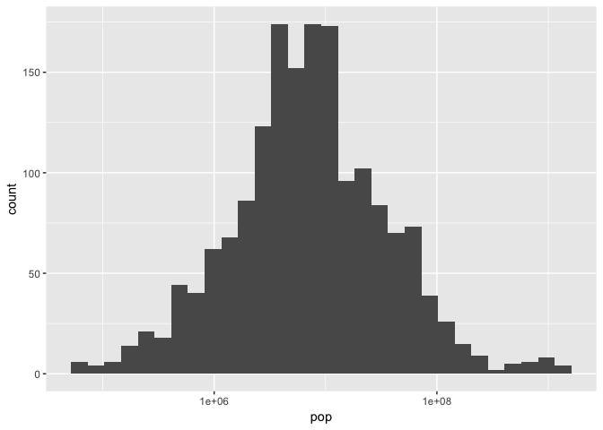

As we were recommended to change the bin size for Histogram, let's modify the bin size for population

``` r
ggplot(gapminder, aes(x=pop)) + geom_histogram(bins=50) +
  scale_x_log10() 
```

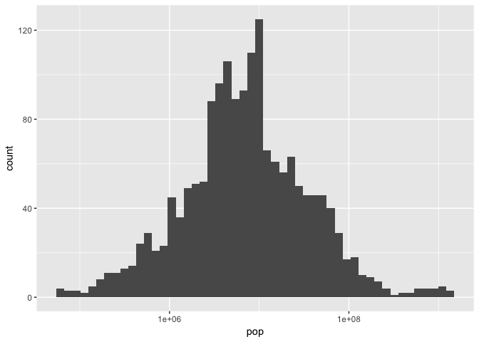

Making a density plot for the histogram:

``` r
ggplot(gapminder, aes(x=pop)) + geom_density() +
  scale_x_log10() 
```

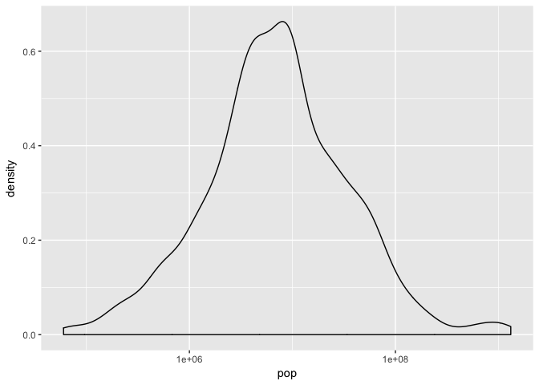

Can you explore more about the nature of the population distribution?

``` r
summary(gapminder$pop)
```

    ##      Min.   1st Qu.    Median      Mean   3rd Qu.      Max. 
    ## 6.001e+04 2.794e+06 7.024e+06 2.960e+07 1.959e+07 1.319e+09

Exploring various plot types
----------------------------

``` r
gapminder %>% 
  ggplot(aes(x=pop)) + geom_histogram(bins=50) +
  scale_x_log10() + facet_wrap(~ continent)
```

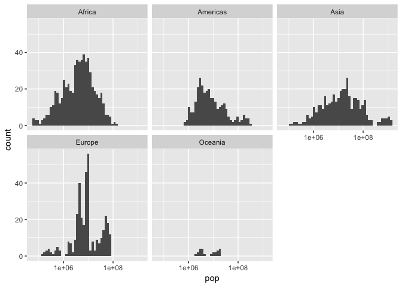

The faceted plot clearly shows that Asia has the highest population

How does the gapminder dataset look when you compare the gdpPercap vs population?

``` r
pvsg <- ggplot(gapminder, aes(pop,gdpPercap)) + scale_x_log10() + scale_y_log10()
pvsg + geom_point()
```

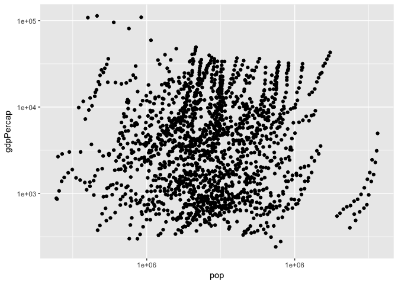

``` r
pvsg + geom_point(aes(colour = continent))
```

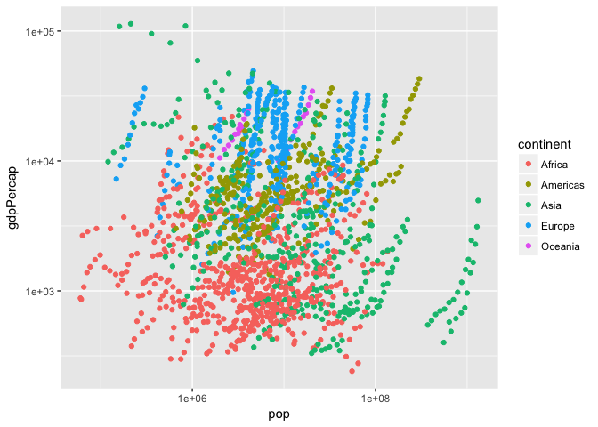

Insights:

-   This graph shows the population vs gdpPercap for the gapminder dataset and it is intersting to see that Europe and Americas are richer than Africa and Asia.

-   Interstingly in Asia, the recipe for a higher GDP is lower population as we can see for the countries on the top left corner of the plot.

Plot of one categorical and one quantitative variable
-----------------------------------------------------

Breaking population down on a per continent basis:

``` r
pvsc <- ggplot(gapminder, aes(continent,pop)) +
  scale_y_log10()
pvsc + geom_boxplot()
```

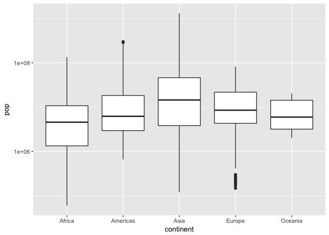

Let's make a violin plot and jitter the points:

``` r
pvsc + geom_violin() +
  geom_jitter(alpha = 0.2)
```

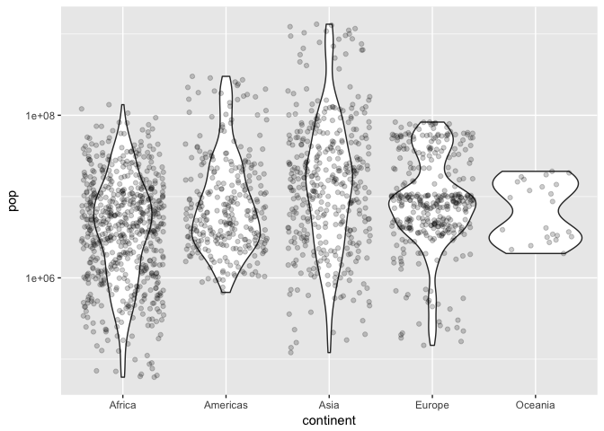

Use filter, select, pipe and do advanced anaysis:
-------------------------------------------------

``` r
africa_data <- gapminder %>% filter(continent =='Africa') %>% 
  select(-continent)
```

Plot life exp for each country over time

``` r
c  <- ggplot(africa_data, aes(year, lifeExp))
c + geom_line(aes(group=country))
```

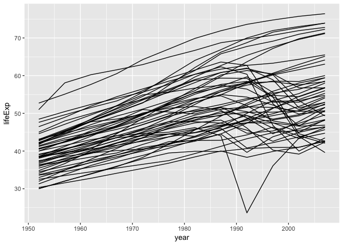

This shows that the life expectancy constantly increases till 1980, after which few countries show a decrease in life exp: Especially one that has a life exp below 30 after 1990!

Which country is it?

``` r
africa_data %>% filter(lifeExp < 30)
```

    ## # A tibble: 1 x 5
    ##   country  year lifeExp     pop gdpPercap
    ##    <fctr> <int>   <dbl>   <int>     <dbl>
    ## 1  Rwanda  1992  23.599 7290203  737.0686

The country is **Rwanda** and what caused this drastic decrease in lifeExp? Did this drop in lifeExp correspond to fluctuations in population and the gdpPercap?

``` r
africa_data %>% filter(country == 'Rwanda') %>% 
  ggplot(aes(year, gdpPercap)) + geom_line()
```

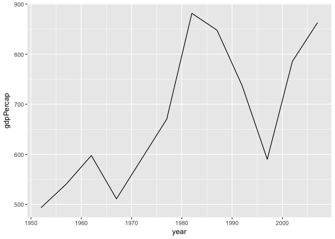

So the GDP was declining since the 1980s and reached a local minimum after 1995.

What about the total population?

``` r
africa_data %>% filter(country == 'Rwanda') %>% 
  ggplot(aes(year, pop)) + geom_line()
```

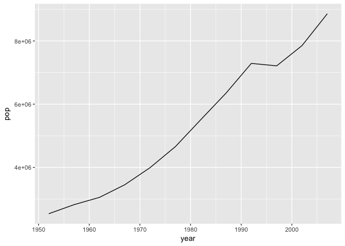

The population was rapidly increasing and abruptly platued after 1992 till 1997 then started increasing again.

These drastic changes in lifeExp, gdpPercap and pop were due to the **Rwanda Genocide** in the 1990s where more than a million people died!

*You can read more about the genocide here:*

1.  [Vox: Rwanda's genocide — what happened, why it happened, and how it still matters](https://www.vox.com/2014/4/10/5590646/rwandan-genocide-anniversary)

2.  [BBC: Rwanda genocide: 100 days of slaughter](https://www.bbc.com/news/world-africa-26875506)

3.  [The New York Times: Rwandan Genocide](https://www.nytimes.com/topic/destination/rwandan-genocide)
